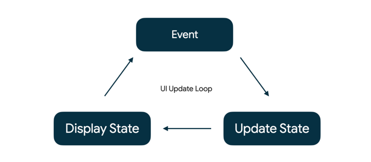
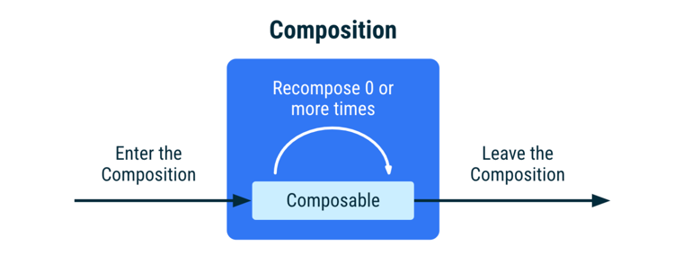
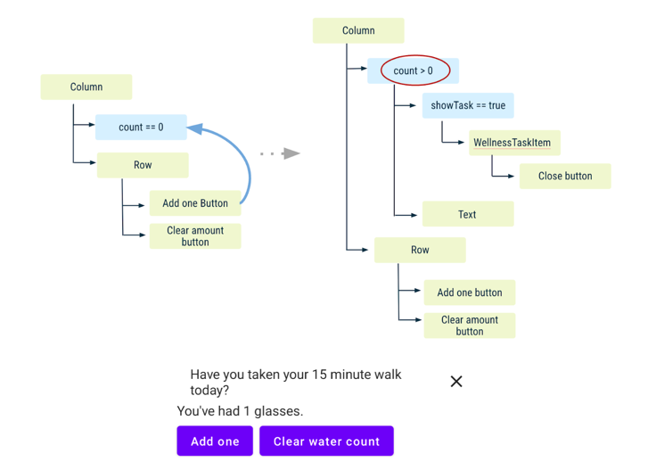
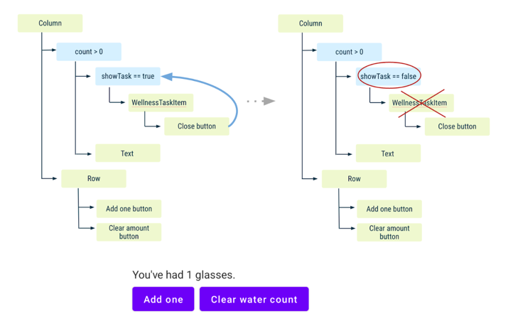
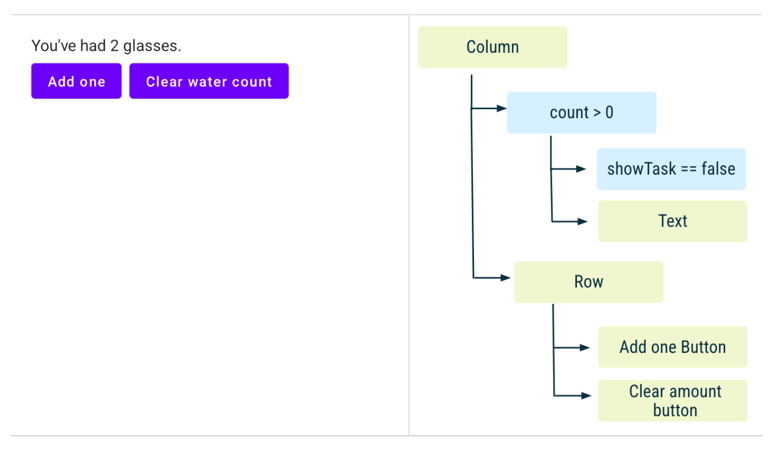
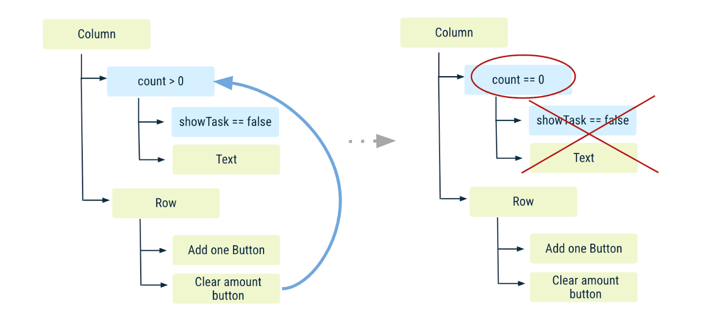
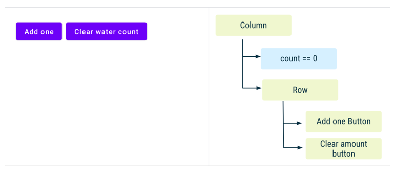

# State in Jetpack Compose

## State in Compose

- application 의 "state" 는 시간에 따라 변할 수 있는 모든 값을 의미합니다.

## Events in Compose

- "state" 는 "events" 에 대한 응답으로 update 됩니다.

> 💡 State `is`. Events `happen`.

- Event: 사용자 또는 다른 프로그램에 의해 발생합니다.
- Update State: 이벤트 핸들러가 UI 에서 사용되는 상태를 변경합니다.
- Display State: UI 가 업데이트되어 새로운 state 가 표시됩니다.

## Memory in a composable function

- The Composition: `composable` 실행 시 Jetpack Compose 에 의해 빌드되는 UI 입니다.
- Initial Composition: 첫 번째 `composable` 수행 시 생기는 Composition 입니다.
- Recomposition: 다시 `composable` 수행 시 data 의 변경이 있다면 Composition 을 업데이트합니다.

이것을 가능하게 하기 위해서는, Compose 가 어떤 state 를 track 해야하는 지 알아야합니다.

- Compose 의 `State`와 `MutableState` 를 사용하면 됩니다.

### remember

- `MutableState` 를 사용하기 위해서는 remember keyword 가 필요합니다.
- `remember` 를 하나의 객체를 Composition 에 저장한다고 생각하면 됩니다.
    - 우리가 평소에 `private val` 변수에다가 객체를 할당하듯이
- `val` 을 통해 value setter 를 사용해도 되지만, `var`과 `by` 를 사용하여 위임할 수도 있습니다.

## State Driven UI

- Compose 는 선언형 UI 프레임워크입니다. 상태가 변경되면 UI 를 없앤다거나 가시성을 바꾼다거나 하지않습니다.
- 우리는 해당 상태의 조건 하에서 UI 가 어떻게 동작하는지 설명할 뿐입니다.

## Remember in Composition

`remember` 키워드는 Composition 에 객체를 저장하고,
`remember` 를 recomposition 도중에 다시 호출하지 않는다면 객체를 forget 합니다.

아래에서 해당 단계의 State Flow 를 알아봅시다.

- Add one 버튼을 누르면 `count` 가 늘어나고, `WellnessTaskItem` 과 카운터 `Text` 가 보이게됩니다.

- `WellnessTaskItem` 을 close 하게되면, `showTask` 플래그가 false 로 수정되며, recomposition 되어
  더이상 `WellnessTaskItem` 이 보이지 않습니다.

- Add one 버튼을 한 번 더 누르게 되면, `showTask` 플래그가 `WellnessTaskItem` 을 닫았던 것을 기억하여 새로운 recomposition 이
  일어나지 않습니다.
- 하지만, glasses 에 대한 `Text` 는 `count` 변수가 수정되었으므로 recomposition 이 일어납니다.

- Clear water count 버튼을 누르게 되면 `count` 가 0으로 변하고, recomposition 을 발생시킵니다.
- `count` 와 관련된 `Text`, `WellnessTaskItem` 과 연관된 코드들이 모두 invoke 되지 않고 Composition 이 끝납니다.

- `showTask` 플래그는 recomposition 되면서 invoke 되지 않았기 때문에 remember 가 forget 하게 됩니다.
- 그러니 우리는 이제 다시 처음으로 돌아갑니다.

## Restore state in Compose
