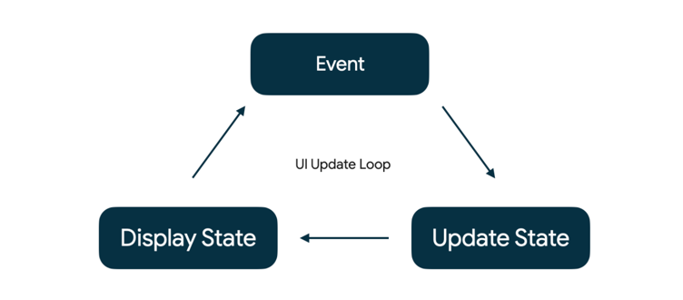

# State in Jetpack Compose

## State in Compose

- application 의 "state" 는 시간에 따라 변할 수 있는 모든 값을 의미합니다.

## Events in Compose

- "state" 는 "events" 에 대한 응답으로 update 됩니다.

> 💡 State `is`. Events `happen`.

- Event: 사용자 또는 다른 프로그램에 의해 발생합니다.
- Update State: 이벤트 핸들러가 UI 에서 사용되는 상태를 변경합니다.
- Display State: UI 가 업데이트되어 새로운 state 가 표시됩니다.

## Memory in a composable function
- The Composition: `composable` 실행 시 Jetpack Compose 에 의해 빌드되는 UI 입니다.
- Initial Composition: 첫 번째 `composable` 수행 시 생기는 Composition 입니다.
- Recomposition: 다시 `composable` 수행 시 data 의 변경이 있다면 Composition 을 업데이트합니다.

이것을 가능하게 하기 위해서는, Compose 가 어떤 state 를 track 해야하는 지 알아야합니다.
- Compose 의 `State`와 `MutableState` 를 사용하면 됩니다.

### remember
- `MutableState` 를 사용하기 위해서는 remember keyword 가 필요합니다.
- remember 를 하나의 객체를 Composition 에 저장한다고 생각하면 됩니다.
  - 우리가 평소에 `private val` 변수에다가 객체를 할당하듯이
- `val` 을 통해 value setter 를 사용해도 되지만, `var`과 `by` 를 사용하여 위임할 수도 있습니다.

## State Driven UI