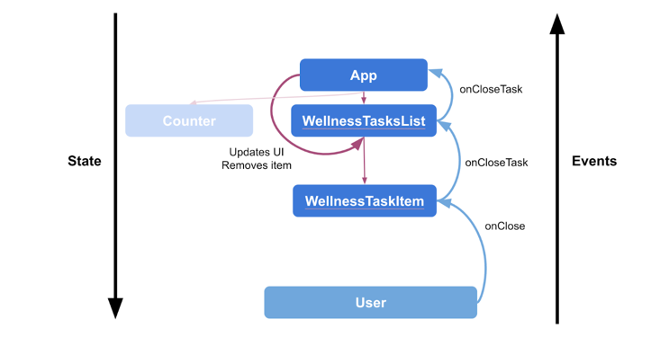

# State in Jetpack Compose

## State in Compose

- application 의 "state" 는 시간에 따라 변할 수 있는 모든 값을 의미합니다.

## Events in Compose

- "state" 는 "events" 에 대한 응답으로 update 됩니다.

> 💡 State `is`. Events `happen`.

- Event: 사용자 또는 다른 프로그램에 의해 발생합니다.
- Update State: 이벤트 핸들러가 UI 에서 사용되는 상태를 변경합니다.
- Display State: UI 가 업데이트되어 새로운 state 가 표시됩니다.

## Memory in a composable function

- The Composition: `composable` 실행 시 Jetpack Compose 에 의해 빌드되는 UI 입니다.
- Initial Composition: 첫 번째 `composable` 수행 시 생기는 Composition 입니다.
- Recomposition: 다시 `composable` 수행 시 data 의 변경이 있다면 Composition 을 업데이트합니다.

이것을 가능하게 하기 위해서는, Compose 가 어떤 state 를 track 해야하는 지 알아야합니다.

- Compose 의 `State`와 `MutableState` 를 사용하면 됩니다.

### remember

- `MutableState` 를 사용하기 위해서는 remember keyword 가 필요합니다.
- `remember` 를 하나의 객체를 Composition 에 저장한다고 생각하면 됩니다.
    - 우리가 평소에 `private val` 변수에다가 객체를 할당하듯이
- `val` 을 통해 value setter 를 사용해도 되지만, `var`과 `by` 를 사용하여 위임할 수도 있습니다.

## State Driven UI

- Compose 는 선언형 UI 프레임워크입니다. 상태가 변경되면 UI 를 없앤다거나 가시성을 바꾼다거나 하지않습니다.
- 우리는 해당 상태의 조건 하에서 UI 가 어떻게 동작하는지 설명할 뿐입니다.

## Remember in Composition

`remember` 키워드는 Composition 에 객체를 저장하고,
`remember` 를 recomposition 도중에 다시 호출하지 않는다면 객체를 forget 합니다.

아래에서 해당 단계의 State Flow 를 알아봅시다.

- Add one 버튼을 누르면 `count` 가 늘어나고, `WellnessTaskItem` 과 카운터 `Text` 가 보이게됩니다.

- `WellnessTaskItem` 을 close 하게되면, `showTask` 플래그가 false 로 수정되며, recomposition 되어
  더이상 `WellnessTaskItem` 이 보이지 않습니다.

- Add one 버튼을 한 번 더 누르게 되면, `showTask` 플래그가 `WellnessTaskItem` 을 닫았던 것을 기억하여 새로운 recomposition 이
  일어나지 않습니다.
- 하지만, glasses 에 대한 `Text` 는 `count` 변수가 수정되었으므로 recomposition 이 일어납니다.

- Clear water count 버튼을 누르게 되면 `count` 가 0으로 변하고, recomposition 을 발생시킵니다.
- `count` 와 관련된 `Text`, `WellnessTaskItem` 과 연관된 코드들이 모두 invoke 되지 않고 Composition 이 끝납니다.

- `showTask` 플래그는 recomposition 되면서 invoke 되지 않았기 때문에 remember 가 forget 하게 됩니다.
- 그러니 우리는 이제 다시 처음으로 돌아갑니다.

## Restore state in Compose

- 기기를 rotate 하거나 light/night 모드를 변경하는 등의 configuration 을 변경할 것입니다.
- `remember` 키워드는 recomposition 시에는 데이터를 유지해주지만, configuration 변경 시에는 유지하지 못합니다.
- 그래서 우리는 `rememberSaveable` 키워드를 사용할 것입니다.

## State hoisting

`remember` 를 사용하여 객체를 저장하는 composable 에는 내부 상태가 포함되어 있습니다. 이는 composable 을 **stateful** 하게 만듭니다.

하지만, 내부 상태를 가지는 composable 은 재사용성이 떨어지고, 테스트하기 어려운 경향이 있습니다.

Composable 이 아무 state 도 가지지 않으면 **stateless composable** 이라고 부릅니다.

Compose 에서의 State hoisting 은 state 를 composable 을 호출하는 곳으로 옮겨서 composable 을 stateless 하게 만드는 것입니다.

hoist 된 state 는 몇가지 중요한 속성들을 가집니다.

- `Single source of truth`: state 를 호출자에게 옮기면, 오로지 하나뿐인 원천지를 보장하기 때문에 버그를 피할 수 있습니다.
- `Shareable`: hoist 된 state 는 여러가지 composable 에서 공유할 수 있습니다.
- `Interceptable`: stateless composable 에 대한 호출자는 상태를 변경하기 전에 이벤트를 무시하거나 수정할 수 있습니다.
- `Decoupled`: stateless composable 함수의 state 는 어디든 저장될 수 있습니다. (예를 들면, ViewModel)

> **stateless** composable 은 아무 state 도 가지지 않는 composable 입니다. 즉 새로운 state 를 가지고 있거나, 정의하거나, 수정하지 않는다는 뜻입니다.
>
> 반면, **stateful** composable 은 언제든지 바꿀 수 있는 state 를 가지고 있습니다.

### Key Point

state 를 hoisting 할 때는 세 가지 규칙을 지켜야 합니다.

1. state 는 __최소한__ 해당 state 를 사용하는 모든 composable 의 **최소 공통 부모**에 의해 hoist 되어야 합니다.
2. state 는 __최소한__ **변경 가능한 가장 높은 레벨**로 hoist 되어야 합니다.
3. 만약 **두 state 가 같은 이벤트의 응답으로 변경되었을 때**에는 **같은 레벨로 hoist** 되어야 합니다.

## Work with lists

### Restore item state in LazyList

- check state 를 단순히 `remember` 로 해버리면, LazyColumn 이 스크롤되어서 해당 composable 이 보이지 않을 때 상태를 잃어버리게 됩니다.
- `rememberSaveable` 을 통해 state 를 유지할 수 있습니다.

### Common patterns in Compose

- composable 함수인 `rememberLazyListState` 를 사용하면, `rememberSaveable` 을 사용하여 리스트의 초기 상태를 만듭니다.
- 그러면 Activity 가 재생성 되었을 때, 스크롤 상태가 유지됩니다.
- `LazyListState` 를 애용해봅시다.

## Observable MutableList

- `MutableList` 의 확장함수인 `toMutableStateList()` 를 사용하면 observable 한 `MutableList` 를 만들 수 있습니다.

## State in ViewModel
